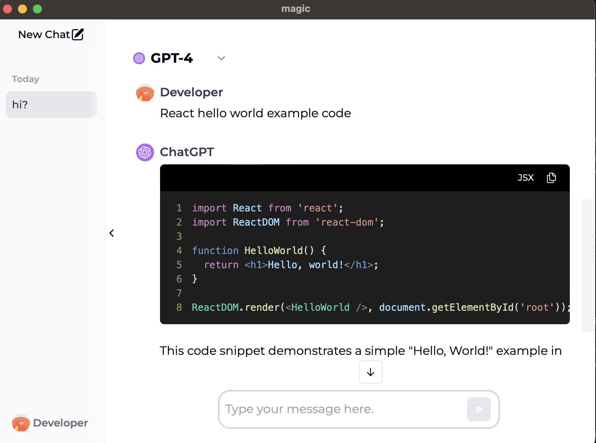
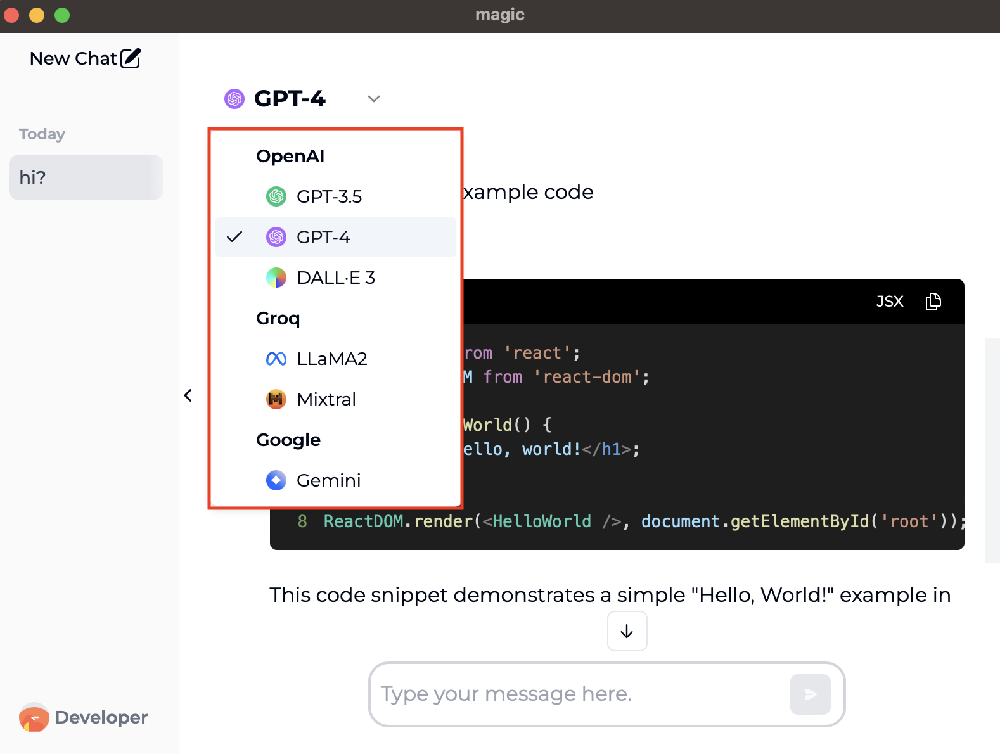

# magic

This is a Chat desktop that allows you to use multiple LLM models by registering your Api Key (e.g. `OpenAI Api Key`).

## Example

### Chat UI


### Chat Models


## Available Models

- OpenAI
  - GPT-3.5
  - GPT-4.0
  - DALL·E 3
- Groq
  - LLama2
  - Mixtral
- Google
  - Gemini

## Install

Download the installation file appropriate for your OS from the GitHub Release tab.

## For Developer

### Tech Stack

[Tauri](https://tauri.app/)+[React](https://react.dev/)+[SQLite](https://www.sqlite.org/)

### Start

```sh
pnpm tauri dev
```